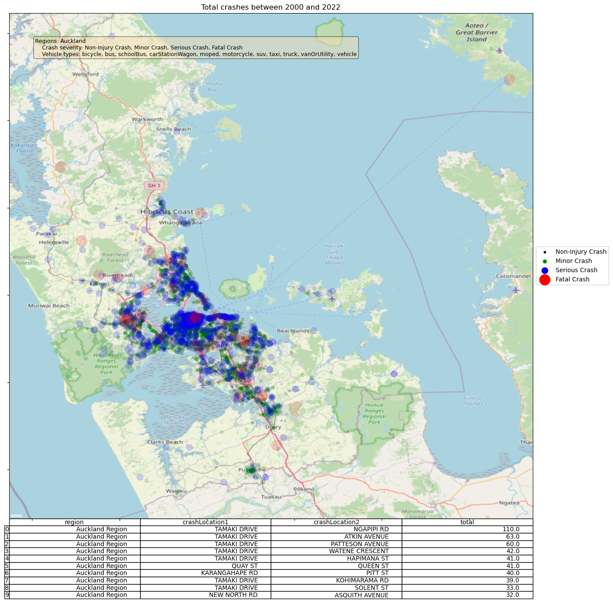
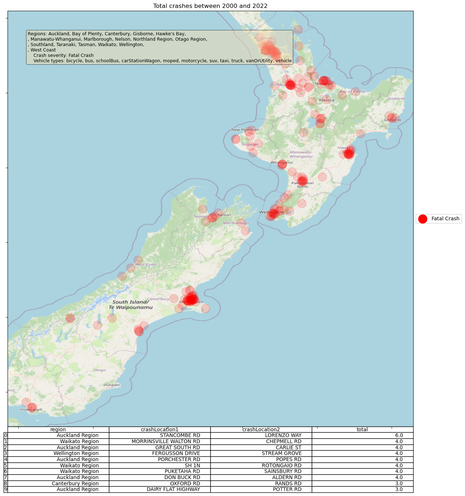
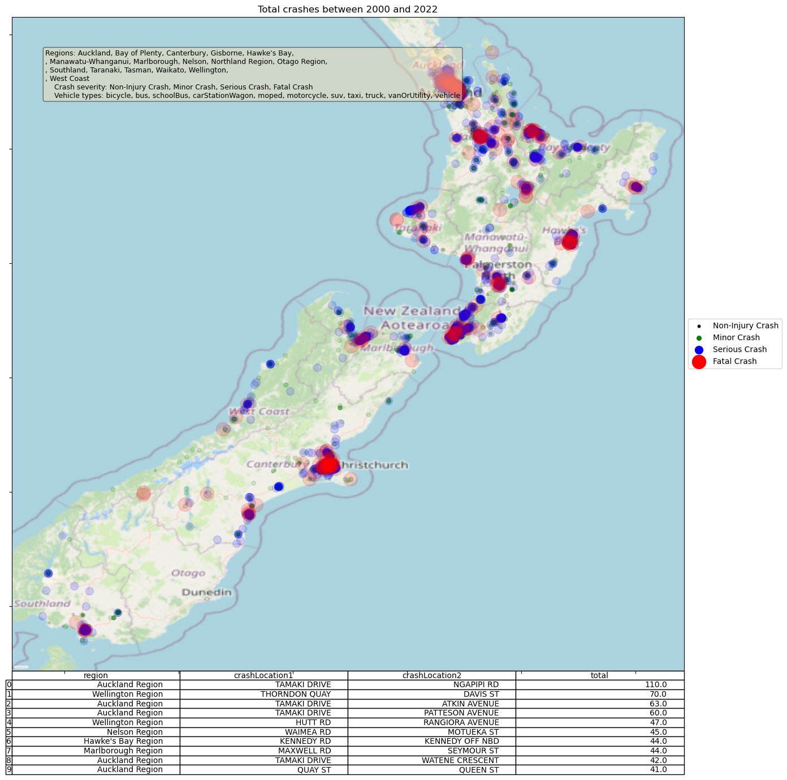

Total crash analysis
=====

Two types of tasks are currently supported in **Crash_severity_model**:

- **Total historical crashes**: using traditional analytical and visualization approaches to show historical crashes.
- **Policy model**: the model allows a policy maker to make assumptions on the road condition (e.g., speed limit, slope etc.) and the model would simulate the risk changes compared to the exisiting policy. 

In this section, **Total historical crashes** is focused.

Usage
***********

Many total historical crashes (minor, severe and fatal) related analysis (and figures) can be produced using:

.. code-block:: bash

   crash_total --workdir <WORKING DIRECTORY>
               [--regions <REGIONS>]
               [--crash_severity <CRASH SEVERITY TYPES>]
               [--vehicle_types <VEHICLE TYPES>]
               [--years <CRASH YEARS>]

where ``--workdir`` must be specified for storing all the intermediate files and the system outputs.

Optionally, the following arguments can be defined:

- ``--regions``: It is used to specify the regions to be used *[default: all regions in NZ]*. It can be chosen from ``Auckland``, ``Bay of Plenty``, ``Canterbury``, ``Gisborne``, ``Hawke's Bay``, ``Manawatu-Whanganui``, ``Marlborough``, ``Nelson``, ``Northland Region``, ``Otago Region``, ``Southland``, ``Taranaki``, ``Tasman``, ``Waikato``, ``Wellington``, ``West Coast``.

- ``--crash_severity``: Crash severity to be analyzed *[default: all crashes types]*. It can be chosen from ``Non-Injury Crash``, ``Minor Crash``, ``Serious Crash`` and ``Fatal Crash``.

- ``--vehicle_types``: Vehicle types to be analyzed *[default: all vehicle types]*. It can be chosen from ``bicycle``, ``bus``, ``schoolBus``, ``carStationWagon``, ``moped``, ``motorcycle``, ``suv``, ``taxi``, ``truck``, ``vanOrUtility``, ``vehicle``.

- ``--years``: Years to be analysed *[default: all years]*. It should be set in a list, e.g., ``--years 2017,2018``.

A few examples are shown below:

Example 1: Fatal crashes in Auckland between 2000 and 2022
***********

.. code-block:: bash

   crash_total --workdir /tmp
               --regions Auckland

The follow figure shows all crash types (and all vehicle types) happened in Auckland between 2000 and 2022.

Example 1: All crashes in Auckland between 2000 and 2022
***********

.. code-block:: bash

   crash_total --workdir /tmp
               --regions Auckland

The following figure shows all crash types (and all vehicle types) happened in Auckland between 2000 and 2022.
The top 10 roads with the most crashes are also listed. 

.. image:: img/total_crashes1.png
   :width: 600

Example 2: Fatal and severe bicycle crashes in Auckland between 2010 and 2020
***********

.. code-block:: bash

   crash_total --workdir /tmp
               --regions Auckland
               --crash_severity 'Serious Crash', 'Fatal Crash'

The following figure shows serious and fatal crashes (for bicyles) happened in Auckland between 2000 and 2022.

.. image:: total_crashes2.png
   :width: 600

Example 3: Fatal crashes in New Zealand between 2000 and 2020
***********

.. code-block:: bash

   crash_total --workdir /tmp
               --crash_severity 'Fatal Crash'

The following figure shows all fatal crashes (for bicyles) happened in New Zealand between 2000 and 2022.

Example 4: All crashes in New Zealand between 2000 and 2020
***********

.. code-block:: bash
   crash_total --workdir /tmp

The following figure shows all crashes (for all vehicle types) happened in New Zealand between 2000 and 2022.

